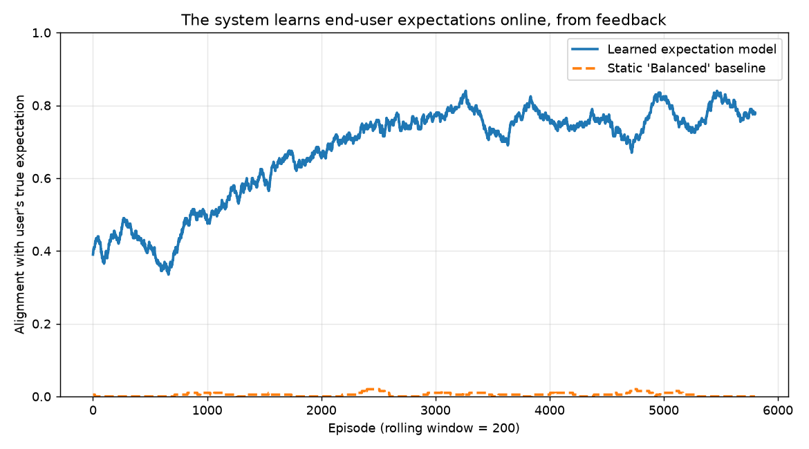

# expectation-aware-adaptation

A small demonstrator of a self-adaptive system that learns a user's expectations
from feedback and explains its adaptation decisions.

This is a **mechanism demonstrator, not a research result.** The "user" is a
hand-built synthetic utility function, so this shows a method working under
known, controlled conditions — it does not validate anything about real users.

## What it does

A simulated autonomous system (think delivery robot or adaptive service) must
pick one of four behavioural configurations — `Aggressive`, `Balanced`,
`Cautious`, `Eco` — as its runtime context changes (how crowded the area is, how
low the battery is, how much time pressure the task is under).

The system is never told what the user wants. It learns their expectations
online, from nothing but approve/reject feedback, using an online logistic
regression over `context × behaviour` interaction features. Crucially, the
feature set mixes the three genuine expectation signals with six distractor
interactions, so the model has to **discover** which expectations actually
matter rather than being handed them. A decaying epsilon-greedy policy keeps the
early feedback spread across the option space. At each step the system picks the
configuration it predicts the user will most approve of, and explains why.

The three parts map onto the goals of the project this was built to align with
(the Vetenskapsrådet / Swedish Research Council project in the Chalmers PhD ad
"Doctoral Student in Human-in-the-Loop Autonomous Systems", supervisor
Asst. Prof. Rebekka Wohlrab):

1. **Awareness of expectations** — learns a user-expectation model from feedback.
2. **Explanation** — justifies each decision from the learned model itself.
3. **Simulation-based evaluation** — measures how fast the learner's choices come
   to match the user's true preference, against a static baseline.

## Faithful explanations

The explanations are constrained to be faithful, not narrated after the fact. A
reason is only surfaced when all three of these hold at once: the cited context
signal is actually high in the current situation, the chosen mode actually has
the cited attribute, and the model has *learned* that this pairing is desirable
(a positive weight). Reasons are then ranked by how strongly they drove the
decision. This means the system cannot give a plausible-sounding reason that is
not grounded in both the situation and what it actually learned.

## Result



After 6000 episodes, on the last 1000:

| Policy | Alignment with the user's true expectation |
|---|---|
| Learned expectation model | ~79% |
| Static "always Balanced" baseline | ~0.3% |

The model recovers all three genuine expectation signals as positive weights,
without being told which of the nine features matter, e.g. from one run:

```
crowd x caution      : +0.80
battery_low x energy : +2.59
time x speed         : +0.44
```

and produces correct, faithful explanations, e.g.:

```
- crowded area, healthy battery, no rush
    Chose 'Cautious' because the area is crowded and this mode is cautious.
    (user's true best here: 'Cautious')
```

## Run

```bash
python3 expectation_aware_adaptation.py
```

Requires Python 3, `numpy`, and `matplotlib`. No other dependencies. The script
prints a report and regenerates `expectation_learning_curve.png`.

## Limitations (read these)

- The user is synthetic. This demonstrates that the mechanism works when the
  ground truth is known; it says nothing about real human users.
- The expectations are learned as a statistical weighting. The project it aligns
  with calls for **formal modelling** of expectations, which this does not do — a
  logistic model is a deliberate stand-in for that direction, not a substitute.
- The speed expectation is the weakest of the three, because only one
  configuration is genuinely fast, so feedback rarely isolates it. This is an
  identifiability limit of the setup, left visible rather than tuned away.

## License

MIT. See `LICENSE`.
