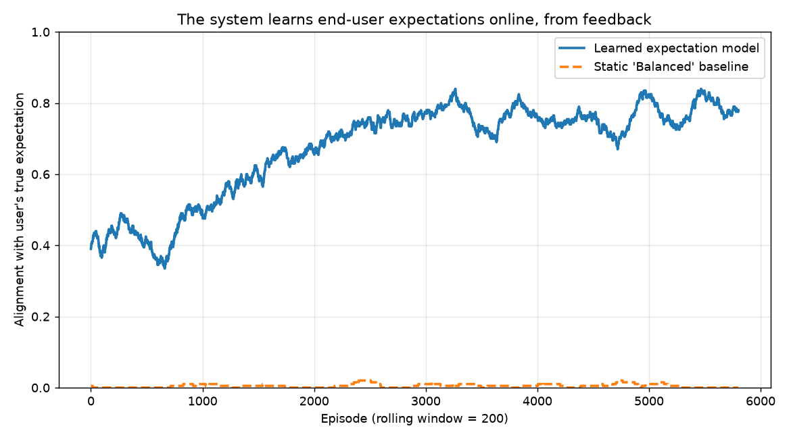
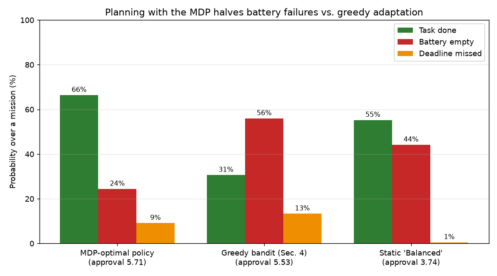

# expectation-aware-adaptation

A small demonstrator of a self-adaptive system that learns a user's expectations
from feedback, explains its adaptation decisions, and **plans over a whole
mission with a Markov Decision Process (MDP) whose properties are verified by
probabilistic model checking (PRISM)**.

This is a **mechanism demonstrator, not a research result.** The "user" is a
hand-built synthetic utility function, so this shows a method working under
known, controlled conditions — it does not validate anything about real users.

## What it does

A simulated autonomous system (think delivery robot or adaptive service) must
pick one of four behavioural configurations — `Aggressive`, `Balanced`,
`Cautious`, `Eco` — as its runtime context changes (how crowded the area is, how
low the battery is, how much time pressure the task is under).

The system is never told what the user wants. It learns their expectations
online, from nothing but approve/reject feedback, using an online logistic
regression over `context × behaviour` interaction features. Crucially, the
feature set mixes the three genuine expectation signals with six distractor
interactions, so the model has to **discover** which expectations actually
matter rather than being handed them. A decaying epsilon-greedy policy keeps the
early feedback spread across the option space. At each step the system picks the
configuration it predicts the user will most approve of, and explains why.

The parts map onto the goals of the project this was built to align with
(the Vetenskapsrådet / Swedish Research Council project in the Chalmers PhD ad
"Doctoral Student in Human-in-the-Loop Autonomous Systems", supervisor
Asst. Prof. Rebekka Wohlrab):

1. **Awareness of expectations** — learns a user-expectation model from feedback.
2. **Explanation** — justifies each decision from the learned model itself.
3. **Simulation-based evaluation** — measures how fast the learner's choices come
   to match the user's true preference, against a static baseline.
4. **Formal planning and verification** — turns the learned expectations into
   the reward of an MDP, computes an optimal adaptation policy, and checks
   probabilistic properties of it with PRISM.

## Faithful explanations

The explanations are constrained to be faithful, not narrated after the fact. A
reason is only surfaced when all three of these hold at once: the cited context
signal is actually high in the current situation, the chosen mode actually has
the cited attribute, and the model has *learned* that this pairing is desirable
(a positive weight). Reasons are then ranked by how strongly they drove the
decision. This means the system cannot give a plausible-sounding reason that is
not grounded in both the situation and what it actually learned.

## Result 1 — learning the user's expectations



After 6000 episodes, on the last 1000:

| Policy | Alignment with the user's true expectation |
|---|---|
| Learned expectation model | ~79% |
| Static "always Balanced" baseline | ~0.3% |

The model recovers all three genuine expectation signals as positive weights,
without being told which of the nine features matter, e.g. from one run:

```
crowd x caution      : +0.80
battery_low x energy : +2.59
time x speed         : +0.44
```

and produces correct, faithful explanations, e.g.:

```
- crowded area, healthy battery, no rush
    Chose 'Cautious' because the area is crowded and this mode is cautious.
    (user's true best here: 'Cautious')
```

## MDP extension — from one-step choices to mission-level planning

The learner above is a **contextual bandit**: each context is sampled
independently, so a choice never affects the future. Real adaptive systems do
not work like that — a fast mode drains the battery, a slow mode risks the
deadline. Section 6 of the script gives the context memory and models the
mission as a finite-horizon MDP:

| Element | Definition |
|---|---|
| State | `(t, battery 0–4, task progress 0–4, crowd quiet/busy)`, horizon `H = 12` |
| Actions | the four configurations |
| Transitions | battery drops with probability rising as `energy_saving` falls; progress rises with probability `speed`; crowd flips with probability 0.2 |
| Reward | the **learned** approval probability of the action in that state |
| Terminal | task done (success); battery empty or deadline missed (failure, penalty) |

So the bandit learns **what** the user wants, and the MDP plans **how** to keep
delivering it without running out of battery or time. The optimal policy is
computed by finite-horizon value iteration, and every policy is evaluated
exactly (a fixed policy turns the MDP into a Markov chain).

## Result 2 — planning vs. greedy adaptation

Exact evaluation from a full battery, no progress, quiet area:



| Policy | Expected approval | Task done | Battery empty | Deadline missed |
|---|---|---|---|---|
| MDP-optimal policy | 5.71 | 66.4% | 24.4% | 9.1% |
| Greedy bandit (always pick the most-approved mode now) | 5.53 | 30.6% | 56.0% | 13.4% |
| Static "Balanced" | 3.74 | 55.3% | 44.2% | 0.5% |

The greedy learner pleases the user step by step but runs out of battery in
more than half of missions; the planner gets slightly *higher* total approval
while cutting the battery-failure rate by more than half. Example disagreements:

```
t= 0 battery=4 progress=0:  MDP -> Eco        greedy -> Cautious
t= 4 battery=4 progress=0:  MDP -> Eco        greedy -> Aggressive
t= 8 battery=4 progress=2:  MDP -> Cautious   greedy -> Aggressive
```

## Result 3 — probabilistic model checking (PRISM)

The script exports the same MDP, with the learned approval as a reward
structure, to `adaptation_mdp.prism`, and PCTL properties to
`adaptation_mdp.props`. Checked with PRISM 4.8.1:

| Property (PCTL) | Meaning | Result |
|---|---|---|
| `Pmax=? [ F "done" ]` | best achievable probability of finishing the task | 0.891 |
| `Pmin=? [ F "battery_empty" ]` | lowest achievable risk of an empty battery | 0.100 |
| `Pmin=? [ F "battery_empty" ] <= 0.05` | does any policy keep that risk ≤ 5%? | **false** |
| `R{"approval"}max=? [ F ("done" \| "battery_empty" \| "missed") ]` | best achievable expected total approval | 6.03 |

The third property is the point of formal verification: it *proves* that, under
this model, no adaptation policy can guarantee a battery risk of 5% or less — a
requirement that would have to be relaxed, or the system redesigned. These
model-checking optima are computed per property; the value-iteration policy in
Result 2 trades approval against a failure penalty, so its numbers sit between
them.

## Run

```bash
python3 expectation_aware_adaptation.py
prism adaptation_mdp.prism adaptation_mdp.props   # optional, requires PRISM
```

Requires Python 3, `numpy`, and `matplotlib`. The script prints both reports,
regenerates `expectation_learning_curve.png` and `mdp_policy_comparison.png`,
and writes `adaptation_mdp.prism`
and `adaptation_mdp.props`. PRISM (https://www.prismmodelchecker.org) is only
needed for the model-checking step.

## Limitations (read these)

- The user is synthetic. This demonstrates that the mechanism works when the
  ground truth is known; it says nothing about real human users.
- Expectations are learned as a statistical weighting; only the planning layer
  is formal. The expectations themselves are not yet specified as formal
  properties (e.g. as PCTL requirements elicited from users).
- The MDP's transition probabilities are hand-set, not learned from data, and
  the state space is deliberately tiny (~600 states).
- The MDP is solved once, after learning. It is not re-planned online as the
  expectation model updates.
- The speed expectation is the weakest of the three, because only one
  configuration is genuinely fast, so feedback rarely isolates it. This is an
  identifiability limit of the setup, left visible rather than tuned away.

## License

MIT. See `LICENSE`.